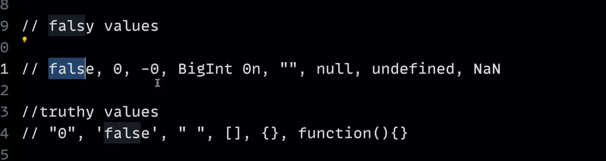

# Javascript official documentation
-   [ECMA](https://tc39.es/ecma262/)
-   [MDN](https://developer.mozilla.org/en-US/docs/Web/JavaScript)

#                                        **rewrite**
    -   Go through all the methods of String on MDN documentation.

# Reason why to use TypeScript

# Codes learned from Hitesh

## let, cont and var : [File](./01_basics/01_variable.js)

-   ### Let:
    -       Used when the value needs to be change
-   ### Const:
    -       Used when value needs to be same or fixed always, not must not change even by mistake also.
-   ### Var:
    -       **Prefer not to use "var" Because of issue in block scope and functional scope**

-   **What is block Scope And functional scope**                                    *Rewrite*

    -   "{}" this is the block scope.

## DataTypes [File](./01_basics/02_dataTypes.js)

-   string, number,bigint, boolean, null, undefined, symbol, object

### null  VS  undefined: 
-   undefined: 
    -   when we have not defined any value to the variable yet.
    -   undefined is the undefined data type
    -   **output of console.log(typeof undefined) is undefined.**
-   null:
    -   null is an representation of an empty value.
    -   null is object data type
    -   **output of console.log(typeof null) is object.**

## conversion between data types [File](./01_basics/03_conversionOperation.js)

### ** Data types are classified on the basis of how data stored into memory and how data can be access **
                                // Interview question
                                
-   Primitive and non primitive
    -   Primitive
        -   7 types of primitive type: String, Number, Boolean, null, undefined, Symbol, BigInt
    -   Non Primitive or referance type
        -   Array, Objects, Functions

**Javascript is Dynamically typed or Statically typed Language ??**
-   Javascript is a dynamically typed language
    -   which means that data types of variables are determined by the value they hold at runtime and can change throughout the program as we assign different values to them.

### Basic maths operations
-   use paranthesis for the complex formulas
-   prefix(++x) and postfix(x++)
    -   x++ returns first and then increment the value
    -   ++x returns after incrementing the value

## comparision [file](/hitesh/01_basics/04_comparision.js)

-   always avoid comparision of null and undefined, specially in the console, because we cannot track the conversion and data type always.

## Strings [file](/hitesh/01_basics/06_num_maths.js)
-   use always bakticks to write a String.
-   write a detailed article by going through MDN documentation, learn about all the methods of string in javascript.                                                   // rewrite

## comparision [file](/hitesh/01_basics/06_num_maths.js)

## functions [file](./02_basics/03_functions.js)
-   ### Implicite return vs Explicite return

-   ### IIFE: Immediately Invoked Function Expressions

## execution context and call stack
-   Global execution context

## Control flow
-   if else, conditions, scope, multiple line using (,) commas,
-   && and || operators
-   switch : case and keys, break;
-   falsy and truthy values
    -   ### Falsy and truthy values
        .

-   check empty array and objects.
-   Nullish Coalescing Operator (??) : works on null and undefined.
-   Terniary Operator

## DOM [file](./DOM/nodeListArray.js)

-   ### NodeList
    -   [16:00 Important discussion about NodeList](https://www.youtube.com/watch?v=xAvTgCsCHLs&t=960s)

## parent children property:    )
-   When we take a variable in DOM, We can excess multiple DOM manipulation properties such as parent, child, firstElementChild, lastElementChild, parentElement, nextElementSibling, ChildNodes etc.

####    Some better approaches
-   Use setAttribute instead of .innerHTML
    -       [26:00 better approach](https://www.youtube.com/watch?v=xAvTgCsCHLs&t=960s)
-   Why to use appendChild over innerHTML
    -   [innerHTML VS appendChild](https://www.youtube.com/watch?v=VQlY-X_eeTE&t=428s)

-   Traversing of document while using .innerHTML so to avoid this use appendChild, it add node text.

## Events: [file](./events/events.js)

## comparision [file](/hitesh/01_basics/04_comparision.js)
## comparision [file](/hitesh/01_basics/04_comparision.js)
## comparision [file](/hitesh/01_basics/04_comparision.js)
## comparision [file](/hitesh/01_basics/04_comparision.js)
## comparision [file](/hitesh/01_basics/04_comparision.js)
## comparision [file](/hitesh/01_basics/04_comparision.js)

#    **Hitesh projects**   [file links]()
